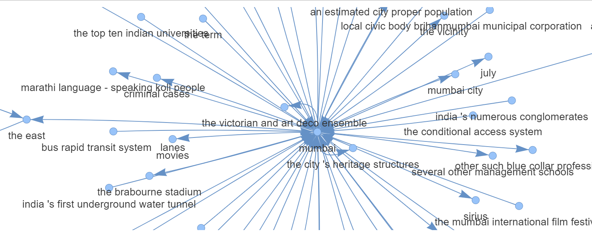

# Knowledge Graph Generator

This Python script utilizes Wikipedia data and natural language processing to generate a knowledge graph and provides a user interface for querying information.

## Usage

1. Install dependencies:
pip install wikipedia-api
pip install spacy=3.5.4
pip install coreferee
pip install networkx
pip install pyvis

and these model 
python -m spacy download en_core_web_lg
python -m coreferee install en

2. Run the script
python knowledge_graph_generator.py

